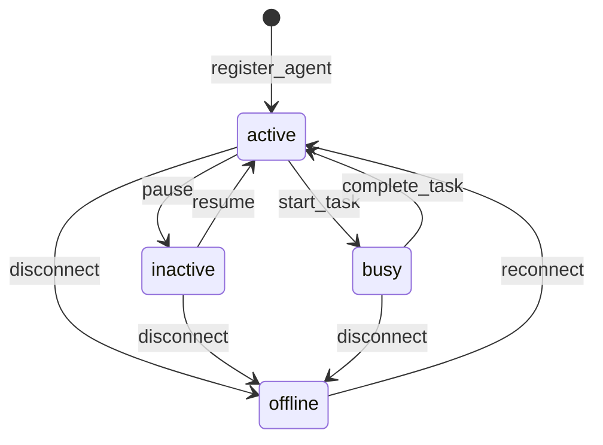

# Agent Management Features

This document provides comprehensive documentation for agent management features
in the Agent Collaboration MCP server, including registration, discovery,
lifecycle management, and metadata handling.

## Table of Contents

1. [Overview](#overview)
2. [Agent Registration](#agent-registration)
3. [Agent Discovery](#agent-discovery)
4. [Lifecycle Management](#lifecycle-management)
5. [Metadata Handling](#metadata-handling)
6. [API Reference](#api-reference)
7. [Examples](#examples)
8. [Best Practices](#best-practices)

## Overview

The agent management system provides a comprehensive framework for registering,
discovering, and managing agents within the knowledge graph ecosystem. Each
agent is represented as an entity with specific metadata that tracks
capabilities, status, and collaboration history.

### Core Concepts

- **Agent Entity**: A knowledge graph entity representing an agent with unique
  identification
- **Agent Registration**: The process of adding an agent to the system with its
  capabilities
- **Agent Discovery**: Finding agents based on capabilities, type, or other
  criteria
- **Lifecycle Management**: Tracking agent status, activity, and availability
- **Metadata**: Rich information about agent capabilities, preferences, and
  state

## Agent Registration

### Registration Process

Agent registration creates a new agent entity in the knowledge graph with
comprehensive metadata.

#### Data Structure

```typescript
interface AgentRegistration {
  agentId: string; // Unique identifier
  name: string; // Human-readable name
  type: string; // Agent type (e.g., 'assistant', 'worker', 'coordinator')
  capabilities: string[]; // List of capabilities
  status: "active" | "inactive" | "busy" | "offline";
  metadata: {
    version?: string;
    description?: string;
    preferences?: Record<string, any>;
    configuration?: Record<string, any>;
    [key: string]: any;
  };
  lastSeen: string; // ISO timestamp
  registeredAt: string; // ISO timestamp
}
```

#### Registration Flow

1. **Validation**: Verify agent ID uniqueness and required fields
2. **Entity Creation**: Create agent entity in knowledge graph
3. **Metadata Assignment**: Store registration data as entity metadata
4. **Status Initialization**: Set initial status to 'active'
5. **Timestamp Recording**: Record registration and last seen times

### MCP Tool: `register_agent`

**Purpose**: Register a new agent in the system

**Parameters**:

- `agentId` (string): Unique identifier for the agent
- `name` (string): Human-readable agent name
- `type` (string): Agent type classification
- `capabilities` (array): List of agent capabilities
- `metadata` (object, optional): Additional agent metadata

**Example**:

```json
{
  "agentId": "assistant-001",
  "name": "Documentation Assistant",
  "type": "assistant",
  "capabilities": ["documentation", "analysis", "writing"],
  "metadata": {
    "version": "1.0.0",
    "description": "Specialized in creating and maintaining documentation",
    "preferences": {
      "language": "english",
      "format": "markdown"
    }
  }
}
```

**Response**:

```json
{
  "success": true,
  "agentId": "assistant-001",
  "message": "Agent registered successfully"
}
```

## Agent Discovery

### Discovery Mechanisms

The system provides multiple ways to discover agents:

1. **Capability-based Discovery**: Find agents with specific capabilities
2. **Type-based Discovery**: Find agents of a particular type
3. **Status-based Discovery**: Find agents with specific status
4. **Metadata-based Discovery**: Find agents based on metadata criteria

### MCP Tool: `discover_agents`

**Purpose**: Find agents based on capabilities, type, or other criteria

**Parameters**:

- `capabilities` (array, optional): Required capabilities
- `agentType` (string, optional): Agent type filter
- `status` (string, optional): Status filter
- `metadata` (object, optional): Metadata criteria

**Example - Capability Discovery**:

```json
{
  "capabilities": ["documentation", "analysis"]
}
```

**Example - Type Discovery**:

```json
{
  "agentType": "assistant",
  "status": "active"
}
```

**Response**:

```json
{
  "agents": [
    {
      "agentId": "assistant-001",
      "name": "Documentation Assistant",
      "type": "assistant",
      "capabilities": ["documentation", "analysis", "writing"],
      "status": "active",
      "lastSeen": "2024-01-15T10:30:00Z"
    }
  ],
  "count": 1
}
```

### MCP Tool: `list_active_agents`

**Purpose**: List all currently active agents

**Parameters**: None

**Response**:

```json
{
  "agents": [
    {
      "agentId": "assistant-001",
      "name": "Documentation Assistant",
      "type": "assistant",
      "status": "active",
      "lastSeen": "2024-01-15T10:30:00Z"
    },
    {
      "agentId": "worker-002",
      "name": "Task Worker",
      "type": "worker",
      "status": "active",
      "lastSeen": "2024-01-15T10:25:00Z"
    }
  ],
  "count": 2
}
```

## Lifecycle Management

### Status Management

Agents have four possible statuses:

- **active**: Agent is available and ready for tasks
- **inactive**: Agent is registered but not currently available
- **busy**: Agent is currently executing tasks
- **offline**: Agent is disconnected or unavailable

### Status Transitions



### MCP Tool: `update_agent_status`

**Purpose**: Update an agent's status and activity information

**Parameters**:

- `agentId` (string): Agent identifier
- `status` (string): New status ('active', 'inactive', 'busy', 'offline')
- `metadata` (object, optional): Additional status metadata

**Example**:

```json
{
  "agentId": "assistant-001",
  "status": "busy",
  "metadata": {
    "currentTask": "documentation-generation",
    "estimatedCompletion": "2024-01-15T11:00:00Z"
  }
}
```

**Response**:

```json
{
  "success": true,
  "agentId": "assistant-001",
  "previousStatus": "active",
  "newStatus": "busy",
  "updatedAt": "2024-01-15T10:30:00Z"
}
```

### MCP Tool: `get_agent_info`

**Purpose**: Retrieve detailed information about a specific agent

**Parameters**:

- `agentId` (string): Agent identifier

**Response**:

```json
{
  "agent": {
    "agentId": "assistant-001",
    "name": "Documentation Assistant",
    "type": "assistant",
    "capabilities": ["documentation", "analysis", "writing"],
    "status": "active",
    "metadata": {
      "version": "1.0.0",
      "description": "Specialized in creating and maintaining documentation",
      "preferences": {
        "language": "english",
        "format": "markdown"
      }
    },
    "lastSeen": "2024-01-15T10:30:00Z",
    "registeredAt": "2024-01-15T09:00:00Z"
  }
}
```

## Metadata Handling

### Metadata Structure

Agent metadata is stored as part of the entity's metadata field and can include:

- **System Metadata**: Version, description, configuration
- **Capability Metadata**: Detailed capability descriptions and parameters
- **Preference Metadata**: Agent preferences and settings
- **State Metadata**: Current state and context information
- **Custom Metadata**: Domain-specific information

### Metadata Best Practices

1. **Structured Data**: Use consistent schemas for common metadata types
2. **Versioning**: Include version information for compatibility tracking
3. **Timestamps**: Record when metadata was last updated
4. **Validation**: Validate metadata against expected schemas
5. **Privacy**: Avoid storing sensitive information in metadata

### Example Metadata Schemas

#### Capability Metadata

```json
{
  "capabilities": {
    "documentation": {
      "formats": ["markdown", "html", "pdf"],
      "languages": ["english", "spanish"],
      "specializations": ["api-docs", "user-guides"]
    },
    "analysis": {
      "types": ["code-analysis", "data-analysis"],
      "tools": ["ast-parser", "metrics-calculator"]
    }
  }
}
```

#### Configuration Metadata

```json
{
  "configuration": {
    "maxConcurrentTasks": 3,
    "timeoutSeconds": 300,
    "retryAttempts": 3,
    "logLevel": "info"
  }
}
```

## API Reference

### Agent Management Tools

| Tool                  | Purpose                 | Parameters                                  | Response                   |
| --------------------- | ----------------------- | ------------------------------------------- | -------------------------- |
| `register_agent`      | Register new agent      | agentId, name, type, capabilities, metadata | Success confirmation       |
| `update_agent_status` | Update agent status     | agentId, status, metadata                   | Status change confirmation |
| `get_agent_info`      | Get agent details       | agentId                                     | Complete agent information |
| `list_active_agents`  | List active agents      | None                                        | Array of active agents     |
| `discover_agents`     | Find agents by criteria | capabilities, agentType, status, metadata   | Matching agents            |

### Error Handling

All agent management tools return standardized error responses:

```json
{
  "success": false,
  "error": "AGENT_NOT_FOUND",
  "message": "Agent with ID 'invalid-agent' not found",
  "code": 404
}
```

Common error codes:

- `AGENT_NOT_FOUND` (404): Agent doesn't exist
- `AGENT_ALREADY_EXISTS` (409): Agent ID already registered
- `INVALID_STATUS` (400): Invalid status value
- `VALIDATION_ERROR` (400): Invalid parameters

## Examples

### Complete Agent Registration Flow

```javascript
// 1. Register a new documentation agent
const registration = {
  agentId: "doc-agent-001",
  name: "Advanced Documentation Agent",
  type: "assistant",
  capabilities: ["documentation", "analysis", "code-review"],
  metadata: {
    version: "2.1.0",
    description: "Advanced agent for comprehensive documentation tasks",
    preferences: {
      language: "english",
      format: "markdown",
      style: "technical"
    },
    configuration: {
      maxConcurrentTasks: 5,
      timeoutSeconds: 600
    }
  }
};

// Register the agent
const result = await callTool("register_agent", registration);
console.log("Registration result:", result);

// 2. Update agent status to busy
const statusUpdate = {
  agentId: "doc-agent-001",
  status: "busy",
  metadata: {
    currentTask: "api-documentation",
    startTime: new Date().toISOString()
  }
};

const statusResult = await callTool("update_agent_status", statusUpdate);
console.log("Status update:", statusResult);

// 3. Discover agents with documentation capabilities
const discovery = {
  capabilities: ["documentation"],
  status: "active"
};

const agents = await callTool("discover_agents", discovery);
console.log("Found agents:", agents);
```

### Agent Discovery Patterns

```javascript
// Find all active assistants
const assistants = await callTool("discover_agents", {
  agentType: "assistant",
  status: "active"
});

// Find agents with specific capabilities
const codeReviewers = await callTool("discover_agents", {
  capabilities: ["code-review", "analysis"]
});

// Find agents with metadata criteria
const highCapacityAgents = await callTool("discover_agents", {
  metadata: {
    "configuration.maxConcurrentTasks": { $gte: 5 }
  }
});
```

### Lifecycle Management Example

```javascript
// Monitor agent lifecycle
class AgentMonitor {
  async monitorAgent(agentId) {
    // Get current agent info
    const info = await callTool("get_agent_info", { agentId });

    if (info.agent.status === "offline") {
      console.log(`Agent ${agentId} is offline`);
      return;
    }

    // Check last seen time
    const lastSeen = new Date(info.agent.lastSeen);
    const now = new Date();
    const minutesSinceLastSeen = (now - lastSeen) / (1000 * 60);

    if (minutesSinceLastSeen > 5) {
      // Mark as inactive if not seen for 5 minutes
      await callTool("update_agent_status", {
        agentId,
        status: "inactive",
        metadata: {
          reason: "timeout",
          lastActivity: info.agent.lastSeen
        }
      });
    }
  }
}
```

## Best Practices

### Registration Best Practices

1. **Unique Identifiers**: Use meaningful, unique agent IDs
2. **Descriptive Names**: Provide clear, human-readable names
3. **Accurate Capabilities**: List only actual agent capabilities
4. **Rich Metadata**: Include comprehensive metadata for discovery
5. **Version Tracking**: Always include version information

### Discovery Best Practices

1. **Specific Queries**: Use specific criteria to reduce result sets
2. **Capability Matching**: Match exact capabilities needed
3. **Status Filtering**: Filter by appropriate status
4. **Caching**: Cache discovery results when appropriate
5. **Fallback Logic**: Implement fallback when no agents found

### Lifecycle Best Practices

1. **Regular Updates**: Update status regularly during task execution
2. **Heartbeat Mechanism**: Implement periodic status updates
3. **Graceful Shutdown**: Update status to offline before disconnecting
4. **Error Handling**: Handle status update failures gracefully
5. **Monitoring**: Monitor agent health and availability

### Metadata Best Practices

1. **Schema Consistency**: Use consistent metadata schemas
2. **Validation**: Validate metadata before storage
3. **Documentation**: Document metadata schemas
4. **Privacy**: Avoid sensitive data in metadata
5. **Versioning**: Version metadata schemas for compatibility

### Performance Considerations

1. **Batch Operations**: Use batch operations for multiple agents
2. **Indexing**: Consider indexing frequently queried metadata
3. **Caching**: Cache frequently accessed agent information
4. **Cleanup**: Regularly clean up inactive agents
5. **Monitoring**: Monitor system performance and agent load

### Security Considerations

1. **Authentication**: Verify agent identity during registration
2. **Authorization**: Control access to agent management operations
3. **Validation**: Validate all input parameters
4. **Audit Logging**: Log all agent management operations
5. **Data Protection**: Protect sensitive agent information
