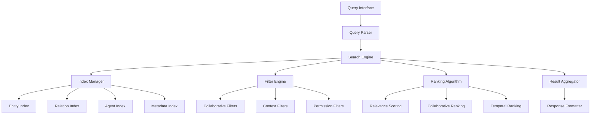

# Enhanced Query and Search Features

This document provides comprehensive documentation for the advanced querying
capabilities and collaborative search features in the agent collaboration
system.

## Overview

The agent collaboration system provides sophisticated query and search
capabilities that enable agents to:

- Perform advanced searches across entities, relations, and agent data
- Use collaborative filtering and recommendation systems
- Execute complex queries with multiple criteria and filters
- Retrieve data using various patterns and access methods
- Leverage graph-based search algorithms for relationship discovery
- Implement real-time search with live updates and notifications

## Core Search Architecture

### Search Components



### Search Data Structures

```typescript
interface SearchQuery {
  query: string; // Search query string
  searchType: "entities" | "relations" | "agents" | "mixed"; // Type of search
  filters: SearchFilters; // Applied filters
  options: SearchOptions; // Search configuration
  context: SearchContext; // Search context
}

interface SearchFilters {
  entityTypes?: string[]; // Filter by entity types
  relationTypes?: string[]; // Filter by relation types
  agentIds?: string[]; // Filter by specific agents
  dateRange?: DateRange; // Filter by date range
  metadata?: Record<string, any>; // Filter by metadata
  permissions?: string[]; // Filter by permissions
  status?: string[]; // Filter by status
}

interface SearchOptions {
  limit?: number; // Maximum results to return
  offset?: number; // Number of results to skip
  sortBy?: string; // Sort field
  sortOrder?: "asc" | "desc"; // Sort direction
  includeMetadata?: boolean; // Include metadata in results
  includeRelations?: boolean; // Include related entities
  fuzzyMatch?: boolean; // Enable fuzzy matching
  caseSensitive?: boolean; // Case sensitive search
}

interface SearchContext {
  requestingAgent: string; // Agent performing search
  collaborativeContext?: string; // Collaborative context ID
  workflowContext?: string; // Workflow context ID
  sessionId?: string; // Search session ID
  preferences?: SearchPreferences; // User search preferences
}

interface SearchResult {
  id: string; // Result identifier
  type: "entity" | "relation" | "agent"; // Result type
  data: any; // Result data
  score: number; // Relevance score
  metadata: Record<string, any>; // Result metadata
  relations?: SearchResult[]; // Related results
  highlights?: string[]; // Search term highlights
}

interface CollaborativeSearchResult {
  results: SearchResult[]; // Primary search results
  recommendations: SearchResult[]; // Collaborative recommendations
  relatedQueries: string[]; // Related query suggestions
  collaborativeMetrics: {
    similarSearches: number; // Number of similar searches
    popularResults: SearchResult[]; // Popular results from similar searches
    trendingTopics: string[]; // Trending search topics
  };
}
```

## Enhanced Query API

### search_nodes

Performs advanced search across entities in the knowledge graph.

| Parameter        | Type     | Required | Description                               |
| ---------------- | -------- | -------- | ----------------------------------------- |
| query            | string   | Yes      | Search query string                       |
| entityTypes      | string[] | No       | Filter by specific entity types           |
| metadata         | object   | No       | Filter by metadata criteria               |
| limit            | number   | No       | Maximum number of results (default: 10)   |
| offset           | number   | No       | Number of results to skip (default: 0)    |
| includeRelations | boolean  | No       | Include related entities (default: false) |
| fuzzyMatch       | boolean  | No       | Enable fuzzy matching (default: true)     |

**Example:**

```json
{
  "query": "data processing workflow",
  "entityTypes": ["workflow", "task", "agent"],
  "metadata": {
    "status": "active",
    "priority": ["high", "urgent"]
  },
  "limit": 20,
  "includeRelations": true,
  "fuzzyMatch": true
}
```

**Response:**

```json
{
  "results": [
    {
      "id": "entity-001",
      "type": "entity",
      "data": {
        "name": "Data Processing Workflow",
        "entityType": "workflow",
        "observations": ["Processes customer data", "Runs daily at 2 AM"]
      },
      "score": 0.95,
      "metadata": {
        "status": "active",
        "priority": "high",
        "lastUpdated": "2024-01-15T10:30:00Z"
      },
      "relations": [
        {
          "id": "entity-002",
          "type": "entity",
          "data": {
            "name": "Data Validation Task",
            "entityType": "task"
          },
          "score": 0.87
        }
      ],
      "highlights": ["data processing", "workflow"]
    }
  ],
  "totalCount": 15,
  "hasMore": false
}
```

### search_by_agent

Searches for entities and relations associated with specific agents.

| Parameter            | Type    | Required | Description                               |
| -------------------- | ------- | -------- | ----------------------------------------- |
| agentId              | string  | Yes      | Target agent identifier                   |
| searchType           | string  | No       | Type of search (entities, relations, all) |
| query                | string  | No       | Optional query string for filtering       |
| dateRange            | object  | No       | Filter by date range                      |
| limit                | number  | No       | Maximum number of results                 |
| includeCollaborative | boolean | No       | Include collaborative data                |

**Example:**

```json
{
  "agentId": "agent-data-processor",
  "searchType": "all",
  "query": "completed tasks",
  "dateRange": {
    "start": "2024-01-01T00:00:00Z",
    "end": "2024-01-31T23:59:59Z"
  },
  "limit": 50,
  "includeCollaborative": true
}
```

### search_by_workflow

Searches for entities and relations within specific workflow contexts.

| Parameter      | Type     | Required | Description                               |
| -------------- | -------- | -------- | ----------------------------------------- |
| workflowId     | string   | Yes      | Target workflow identifier                |
| searchType     | string   | No       | Type of search (tasks, agents, resources) |
| status         | string[] | No       | Filter by status values                   |
| participantId  | string   | No       | Filter by specific participant            |
| includeHistory | boolean  | No       | Include historical data                   |

**Example:**

```json
{
  "workflowId": "workflow-data-pipeline",
  "searchType": "tasks",
  "status": ["completed", "in_progress"],
  "includeHistory": true
}
```

## Collaborative Search Features

### Collaborative Filtering

The system implements collaborative filtering to enhance search results based
on:

1. **Agent Behavior Patterns**: Learning from agent search and interaction
   patterns
2. **Collaborative Recommendations**: Suggesting results based on similar
   agents' activities
3. **Context-Aware Filtering**: Adapting results based on current workflow or
   task context
4. **Social Filtering**: Leveraging agent relationships and collaboration
   history

### Collaborative Search Implementation

```typescript
class CollaborativeSearchEngine {
  private agentProfiles: Map<string, AgentProfile>;
  private searchHistory: Map<string, SearchHistory[]>;
  private collaborationGraph: CollaborationGraph;

  async performCollaborativeSearch(
    query: SearchQuery,
    requestingAgent: string
  ): Promise<CollaborativeSearchResult> {
    // Get base search results
    const baseResults = await this.performBaseSearch(query);

    // Apply collaborative filtering
    const collaborativeResults = await this.applyCollaborativeFiltering(
      baseResults,
      requestingAgent,
      query
    );

    // Generate recommendations
    const recommendations = await this.generateRecommendations(
      query,
      requestingAgent
    );

    // Get related queries
    const relatedQueries = await this.getRelatedQueries(query, requestingAgent);

    // Calculate collaborative metrics
    const collaborativeMetrics = await this.calculateCollaborativeMetrics(
      query,
      requestingAgent
    );

    return {
      results: collaborativeResults,
      recommendations,
      relatedQueries,
      collaborativeMetrics
    };
  }

  private async applyCollaborativeFiltering(
    results: SearchResult[],
    requestingAgent: string,
    query: SearchQuery
  ): Promise<SearchResult[]> {
    const agentProfile = this.agentProfiles.get(requestingAgent);
    const similarAgents = await this.findSimilarAgents(requestingAgent);

    // Apply collaborative scoring
    for (const result of results) {
      const collaborativeScore = await this.calculateCollaborativeScore(
        result,
        agentProfile,
        similarAgents
      );

      result.score = result.score * 0.7 + collaborativeScore * 0.3;
    }

    // Re-sort by updated scores
    return results.sort((a, b) => b.score - a.score);
  }

  private async generateRecommendations(
    query: SearchQuery,
    requestingAgent: string
  ): Promise<SearchResult[]> {
    const agentProfile = this.agentProfiles.get(requestingAgent);
    const collaborators = await this.getFrequentCollaborators(requestingAgent);

    const recommendations: SearchResult[] = [];

    // Content-based recommendations
    const contentRecommendations = await this.getContentBasedRecommendations(
      query,
      agentProfile
    );
    recommendations.push(...contentRecommendations);

    // Collaborative recommendations
    const collaborativeRecommendations =
      await this.getCollaborativeRecommendations(query, collaborators);
    recommendations.push(...collaborativeRecommendations);

    // Trending recommendations
    const trendingRecommendations = await this.getTrendingRecommendations(
      query.context
    );
    recommendations.push(...trendingRecommendations);

    return this.deduplicateAndRank(recommendations);
  }
}
```

### Search Personalization

```typescript
interface AgentProfile {
  agentId: string;
  searchPreferences: {
    preferredEntityTypes: string[];
    searchFrequency: Record<string, number>;
    interactionPatterns: Record<string, number>;
    collaborationHistory: string[];
  };
  behaviorMetrics: {
    averageSessionDuration: number;
    searchToActionRatio: number;
    collaborationFrequency: number;
    expertiseDomains: string[];
  };
  contextualPreferences: {
    workflowContexts: Record<string, SearchPreferences>;
    timeBasedPreferences: Record<string, SearchPreferences>;
    collaboratorPreferences: Record<string, SearchPreferences>;
  };
}

interface SearchPreferences {
  sortPreference: "relevance" | "date" | "popularity" | "collaborative";
  resultDensity: "minimal" | "standard" | "detailed";
  includeRecommendations: boolean;
  fuzzyMatchTolerance: number;
  collaborativeWeight: number;
}
```

## Advanced Filtering Options

### Multi-Criteria Filtering

```typescript
interface AdvancedFilters {
  // Entity-specific filters
  entityFilters: {
    types: string[];
    createdBy: string[];
    lastModified: DateRange;
    observationCount: NumberRange;
    hasRelations: boolean;
  };

  // Relation-specific filters
  relationFilters: {
    types: string[];
    sourceEntities: string[];
    targetEntities: string[];
    strength: NumberRange;
    bidirectional: boolean;
  };

  // Agent-specific filters
  agentFilters: {
    status: string[];
    capabilities: string[];
    workflowParticipation: string[];
    collaborationLevel: NumberRange;
    lastActive: DateRange;
  };

  // Metadata filters
  metadataFilters: {
    hasKey: string[];
    keyValuePairs: Record<string, any>;
    numericRanges: Record<string, NumberRange>;
    textMatches: Record<string, string>;
  };

  // Collaborative filters
  collaborativeFilters: {
    sharedWith: string[];
    accessLevel: string[];
    collaborationContext: string[];
    popularityThreshold: number;
  };
}

interface NumberRange {
  min?: number;
  max?: number;
}

interface DateRange {
  start?: string;
  end?: string;
}
```

### Dynamic Filter Application

```typescript
class FilterEngine {
  async applyFilters(
    results: SearchResult[],
    filters: AdvancedFilters,
    context: SearchContext
  ): Promise<SearchResult[]> {
    let filteredResults = results;

    // Apply entity filters
    if (filters.entityFilters) {
      filteredResults = await this.applyEntityFilters(
        filteredResults,
        filters.entityFilters
      );
    }

    // Apply relation filters
    if (filters.relationFilters) {
      filteredResults = await this.applyRelationFilters(
        filteredResults,
        filters.relationFilters
      );
    }

    // Apply agent filters
    if (filters.agentFilters) {
      filteredResults = await this.applyAgentFilters(
        filteredResults,
        filters.agentFilters
      );
    }

    // Apply metadata filters
    if (filters.metadataFilters) {
      filteredResults = await this.applyMetadataFilters(
        filteredResults,
        filters.metadataFilters
      );
    }

    // Apply collaborative filters
    if (filters.collaborativeFilters) {
      filteredResults = await this.applyCollaborativeFilters(
        filteredResults,
        filters.collaborativeFilters,
        context
      );
    }

    return filteredResults;
  }
}
```

## Data Retrieval Patterns

### Graph Traversal Patterns

```typescript
interface GraphTraversalQuery {
  startNodes: string[]; // Starting entity IDs
  traversalType: "breadth" | "depth" | "shortest_path" | "all_paths";
  maxDepth: number; // Maximum traversal depth
  relationTypes: string[]; // Allowed relation types
  stopConditions: StopCondition[]; // Conditions to stop traversal
  collectMetrics: boolean; // Collect traversal metrics
}

interface StopCondition {
  type: "entity_type" | "relation_count" | "depth" | "custom";
  value: any;
  operator: "equals" | "greater_than" | "less_than" | "contains";
}

class GraphTraversalEngine {
  async traverseGraph(
    query: GraphTraversalQuery
  ): Promise<GraphTraversalResult> {
    const visited = new Set<string>();
    const paths: GraphPath[] = [];
    const metrics = new TraversalMetrics();

    for (const startNode of query.startNodes) {
      const nodePaths = await this.traverseFromNode(
        startNode,
        query,
        visited,
        metrics
      );
      paths.push(...nodePaths);
    }

    return {
      paths,
      metrics: query.collectMetrics ? metrics : undefined,
      totalNodes: visited.size,
      totalPaths: paths.length
    };
  }

  private async traverseFromNode(
    nodeId: string,
    query: GraphTraversalQuery,
    visited: Set<string>,
    metrics: TraversalMetrics,
    currentDepth: number = 0,
    currentPath: string[] = []
  ): Promise<GraphPath[]> {
    if (currentDepth >= query.maxDepth) {
      return [];
    }

    if (visited.has(nodeId)) {
      return [];
    }

    visited.add(nodeId);
    currentPath.push(nodeId);

    // Check stop conditions
    if (await this.checkStopConditions(nodeId, query.stopConditions)) {
      return [{ nodes: [...currentPath], depth: currentDepth }];
    }

    const relations = await this.getNodeRelations(nodeId, query.relationTypes);
    const paths: GraphPath[] = [];

    for (const relation of relations) {
      const targetNode = relation.to === nodeId ? relation.from : relation.to;
      const subPaths = await this.traverseFromNode(
        targetNode,
        query,
        new Set(visited),
        metrics,
        currentDepth + 1,
        [...currentPath]
      );
      paths.push(...subPaths);
    }

    return paths;
  }
}
```

### Aggregation Patterns

```typescript
interface AggregationQuery {
  groupBy: string[]; // Fields to group by
  aggregations: Aggregation[]; // Aggregation operations
  filters: AdvancedFilters; // Pre-aggregation filters
  having: HavingCondition[]; // Post-aggregation filters
  orderBy: OrderByClause[]; // Result ordering
  limit?: number; // Result limit
}

interface Aggregation {
  field: string; // Field to aggregate
  operation: "count" | "sum" | "avg" | "min" | "max" | "distinct";
  alias: string; // Result field name
}

interface HavingCondition {
  field: string; // Aggregated field
  operator: "gt" | "lt" | "eq" | "gte" | "lte" | "ne";
  value: number;
}

class AggregationEngine {
  async performAggregation(
    query: AggregationQuery
  ): Promise<AggregationResult[]> {
    // Get base data with filters applied
    const baseData = await this.getFilteredData(query.filters);

    // Group data
    const groupedData = this.groupData(baseData, query.groupBy);

    // Apply aggregations
    const aggregatedData = this.applyAggregations(
      groupedData,
      query.aggregations
    );

    // Apply having conditions
    const filteredData = this.applyHavingConditions(
      aggregatedData,
      query.having
    );

    // Order results
    const orderedData = this.orderResults(filteredData, query.orderBy);

    // Apply limit
    return query.limit ? orderedData.slice(0, query.limit) : orderedData;
  }
}
```

## Real-Time Search Features

### Live Search Updates

```typescript
interface LiveSearchSession {
  sessionId: string;
  query: SearchQuery;
  lastUpdate: string;
  updateFrequency: number; // Update interval in milliseconds
  subscribers: string[]; // Subscribed agent IDs
  filters: AdvancedFilters;
  notifications: NotificationSettings;
}

interface NotificationSettings {
  newResults: boolean; // Notify on new results
  resultChanges: boolean; // Notify on result modifications
  relevanceChanges: boolean; // Notify on relevance score changes
  collaborativeUpdates: boolean; // Notify on collaborative changes
  threshold: number; // Minimum change threshold
}

class LiveSearchEngine {
  private activeSessions: Map<string, LiveSearchSession>;
  private updateScheduler: NodeJS.Timer;

  async createLiveSearchSession(
    query: SearchQuery,
    agentId: string,
    updateFrequency: number = 5000
  ): Promise<string> {
    const sessionId = this.generateSessionId();
    const session: LiveSearchSession = {
      sessionId,
      query,
      lastUpdate: new Date().toISOString(),
      updateFrequency,
      subscribers: [agentId],
      filters: query.filters,
      notifications: {
        newResults: true,
        resultChanges: true,
        relevanceChanges: false,
        collaborativeUpdates: true,
        threshold: 0.1
      }
    };

    this.activeSessions.set(sessionId, session);
    this.scheduleUpdates();

    return sessionId;
  }

  private async processLiveUpdates(): Promise<void> {
    for (const [sessionId, session] of this.activeSessions) {
      try {
        const currentResults = await this.performSearch(session.query);
        const previousResults = await this.getPreviousResults(sessionId);

        const changes = this.detectChanges(
          previousResults,
          currentResults,
          session.notifications.threshold
        );

        if (changes.hasSignificantChanges) {
          await this.notifySubscribers(session, changes);
          await this.updateStoredResults(sessionId, currentResults);
        }

        session.lastUpdate = new Date().toISOString();
      } catch (error) {
        console.error(
          `Error updating live search session ${sessionId}:`,
          error
        );
      }
    }
  }
}
```

## Practical Examples

### Complex Multi-Criteria Search

```typescript
// Search for high-priority workflow tasks assigned to specific agents
const complexSearch = {
  query: "data validation processing",
  searchType: "mixed",
  filters: {
    entityTypes: ["task", "workflow"],
    agentIds: ["agent-validator", "agent-processor"],
    metadata: {
      priority: ["high", "urgent"],
      status: ["in_progress", "pending"]
    },
    dateRange: {
      start: "2024-01-01T00:00:00Z",
      end: "2024-01-31T23:59:59Z"
    }
  },
  options: {
    limit: 25,
    sortBy: "priority",
    sortOrder: "desc",
    includeMetadata: true,
    includeRelations: true,
    fuzzyMatch: true
  },
  context: {
    requestingAgent: "agent-coordinator",
    workflowContext: "data-pipeline-workflow",
    sessionId: "search-session-001"
  }
};

const results = await searchNodes(complexSearch);
```

### Collaborative Search with Recommendations

```typescript
// Perform collaborative search with personalized recommendations
const collaborativeSearch = async (agentId: string, query: string) => {
  // Get agent profile and preferences
  const agentProfile = await getAgentProfile(agentId);

  // Perform base search
  const baseResults = await searchNodes({
    query,
    options: {
      limit: 20,
      includeMetadata: true,
      fuzzyMatch: true
    },
    context: {
      requestingAgent: agentId
    }
  });

  // Get collaborative recommendations
  const recommendations = await getCollaborativeRecommendations({
    agentId,
    query,
    baseResults,
    includePopular: true,
    includeTrending: true
  });

  // Get related queries from similar agents
  const relatedQueries = await getRelatedQueries({
    agentId,
    query,
    limit: 5
  });

  return {
    results: baseResults,
    recommendations,
    relatedQueries,
    personalizedInsights: {
      searchHistory: await getRecentSearchHistory(agentId, 10),
      frequentCollaborators: await getFrequentCollaborators(agentId),
      expertiseDomains: agentProfile.behaviorMetrics.expertiseDomains
    }
  };
};
```

### Graph Traversal Search

```typescript
// Find all related entities within 3 degrees of separation
const graphTraversal = {
  startNodes: ["entity-workflow-001"],
  traversalType: "breadth",
  maxDepth: 3,
  relationTypes: ["depends_on", "collaborates_with", "shares_resource"],
  stopConditions: [
    {
      type: "entity_type",
      value: "critical_resource",
      operator: "equals"
    }
  ],
  collectMetrics: true
};

const traversalResult = await traverseGraph(graphTraversal);

// Process traversal results
for (const path of traversalResult.paths) {
  console.log(`Path found: ${path.nodes.join(" -> ")} (depth: ${path.depth})`);
}
```

### Real-Time Search Monitoring

```typescript
// Set up live search for critical system events
const liveSearchSetup = async () => {
  const sessionId = await createLiveSearchSession(
    {
      query: "system error critical failure",
      searchType: "entities",
      filters: {
        entityTypes: ["event", "alert", "error"],
        metadata: {
          severity: ["critical", "high"],
          status: "active"
        }
      },
      options: {
        limit: 50,
        sortBy: "timestamp",
        sortOrder: "desc"
      }
    },
    "agent-monitor",
    2000 // Update every 2 seconds
  );

  // Subscribe to live updates
  await subscribeToLiveSearchUpdates(sessionId, (updates) => {
    if (updates.newResults.length > 0) {
      console.log(`New critical events detected: ${updates.newResults.length}`);
      // Trigger alert system
      triggerCriticalAlerts(updates.newResults);
    }
  });

  return sessionId;
};
```

## Best Practices

### Query Optimization

1. **Index Strategy**: Use appropriate indexes for frequently searched fields
2. **Query Specificity**: Make queries as specific as possible to reduce search
   space
3. **Filter Early**: Apply filters before expensive operations like fuzzy
   matching
4. **Pagination**: Use pagination for large result sets to improve performance
5. **Caching**: Cache frequently accessed search results and recommendations
6. **Batch Operations**: Batch multiple related queries when possible

### Collaborative Search Best Practices

1. **Privacy Preservation**: Ensure collaborative features respect agent privacy
2. **Relevance Tuning**: Continuously tune collaborative scoring algorithms
3. **Diversity**: Balance relevance with result diversity in recommendations
4. **Feedback Loops**: Implement feedback mechanisms to improve recommendations
5. **Context Awareness**: Consider current context when generating
   recommendations
6. **Performance Monitoring**: Monitor collaborative search performance and
   accuracy

### Search Performance Optimization

1. **Query Analysis**: Analyze query patterns to optimize indexing strategy
2. **Result Caching**: Cache search results with appropriate TTL values
3. **Lazy Loading**: Load detailed information only when needed
4. **Parallel Processing**: Execute independent search operations in parallel
5. **Resource Management**: Monitor and manage search resource consumption
6. **Scalability Planning**: Design search architecture for horizontal scaling

### Security and Privacy

1. **Access Control**: Implement fine-grained access control for search results
2. **Query Auditing**: Log and audit search queries for security monitoring
3. **Data Sanitization**: Sanitize search queries to prevent injection attacks
4. **Result Filtering**: Filter search results based on agent permissions
5. **Privacy Protection**: Protect sensitive information in collaborative
   features
6. **Compliance**: Ensure search features comply with data protection
   regulations

This comprehensive enhanced query and search system provides powerful, flexible,
and collaborative search capabilities while maintaining security, performance,
and user experience standards.
