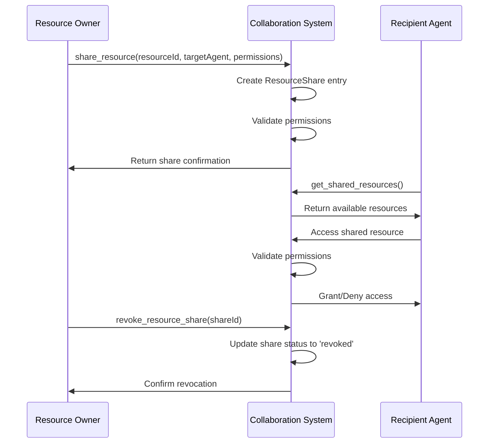

# Resource Sharing and Communication

This document provides comprehensive documentation for the resource sharing
capabilities and communication features in the agent collaboration system.

## Overview

The agent collaboration system provides robust resource sharing and
communication mechanisms that enable agents to:

- Share and manage resources with fine-grained access control
- Communicate through multiple channels (direct messaging, events, channels)
- Subscribe to and publish events for real-time coordination
- Discover and interact with other agents in the system
- Maintain persistent communication history and resource states

## Resource Sharing

### Core Concepts

**Resource**: Any shareable entity in the system (files, data, configurations,
services) **Resource Share**: A permission grant allowing specific agents to
access a resource **Access Control**: Fine-grained permissions (read, write,
execute, admin) **Resource Lock**: Exclusive access mechanism for critical
resources

### Resource Data Structure

```typescript
interface ResourceShare {
  id: string; // Unique share identifier
  resourceId: string; // Resource being shared
  resourceType: string; // Type of resource (file, data, service)
  ownerId: string; // Agent that owns the resource
  sharedWithId: string; // Agent receiving access
  permissions: string[]; // Access permissions array
  metadata: Record<string, any>; // Additional resource metadata
  createdAt: string; // Share creation timestamp
  expiresAt?: string; // Optional expiration time
  status: "active" | "revoked" | "expired"; // Share status
}

interface ResourceLock {
  resourceId: string; // Locked resource identifier
  lockedBy: string; // Agent holding the lock
  lockType: "read" | "write" | "exclusive"; // Lock type
  acquiredAt: string; // Lock acquisition time
  expiresAt?: string; // Optional lock expiration
  metadata: Record<string, any>; // Lock metadata
}
```

### Resource Sharing Process



### Resource Management API

#### share_resource

Shares a resource with another agent with specified permissions.

| Parameter    | Type     | Required | Description                                        |
| ------------ | -------- | -------- | -------------------------------------------------- |
| resourceId   | string   | Yes      | Unique identifier of the resource to share         |
| resourceType | string   | Yes      | Type of resource (file, data, service, etc.)       |
| sharedWithId | string   | Yes      | ID of the agent to share with                      |
| permissions  | string[] | Yes      | Array of permissions (read, write, execute, admin) |
| metadata     | object   | No       | Additional resource metadata                       |
| expiresAt    | string   | No       | Optional expiration timestamp                      |

**Example:**

```json
{
  "resourceId": "config-file-001",
  "resourceType": "configuration",
  "sharedWithId": "agent-data-processor",
  "permissions": ["read", "write"],
  "metadata": {
    "description": "Database configuration file",
    "version": "1.2.0",
    "critical": true
  },
  "expiresAt": "2024-12-31T23:59:59Z"
}
```

#### revoke_resource_share

Revokes a previously granted resource share.

| Parameter | Type   | Required | Description                              |
| --------- | ------ | -------- | ---------------------------------------- |
| shareId   | string | Yes      | Unique identifier of the share to revoke |

#### get_shared_resources

Retrieves all resources shared with the requesting agent.

| Parameter    | Type   | Required | Description                                             |
| ------------ | ------ | -------- | ------------------------------------------------------- |
| agentId      | string | No       | Filter by specific agent (defaults to requesting agent) |
| resourceType | string | No       | Filter by resource type                                 |
| status       | string | No       | Filter by share status                                  |

#### get_resource_shares

Retrieves all shares created by the requesting agent.

| Parameter    | Type   | Required | Description                 |
| ------------ | ------ | -------- | --------------------------- |
| resourceId   | string | No       | Filter by specific resource |
| sharedWithId | string | No       | Filter by recipient agent   |
| status       | string | No       | Filter by share status      |

### Resource Locking

#### lock_resource

Acquires an exclusive lock on a resource.

| Parameter  | Type   | Required | Description                           |
| ---------- | ------ | -------- | ------------------------------------- |
| resourceId | string | Yes      | Resource to lock                      |
| lockType   | string | Yes      | Type of lock (read, write, exclusive) |
| duration   | number | No       | Lock duration in milliseconds         |
| metadata   | object | No       | Additional lock metadata              |

#### unlock_resource

Releases a previously acquired resource lock.

| Parameter  | Type   | Required | Description                                |
| ---------- | ------ | -------- | ------------------------------------------ |
| resourceId | string | Yes      | Resource to unlock                         |
| lockId     | string | No       | Specific lock ID (if multiple locks exist) |

#### check_resource_status

Checks the current lock status of a resource.

| Parameter  | Type   | Required | Description       |
| ---------- | ------ | -------- | ----------------- |
| resourceId | string | Yes      | Resource to check |

## Communication Features

### Communication Patterns

1. **Direct Messaging**: Point-to-point communication between agents
2. **Event-Driven Communication**: Publish-subscribe pattern for loose coupling
3. **Channel-Based Communication**: Group communication in named channels
4. **Broadcast Messaging**: One-to-many communication to all agents

### Message Data Structure

```typescript
interface AgentMessage {
  id: string; // Unique message identifier
  fromId: string; // Sender agent ID
  toId: string; // Recipient agent ID
  content: string; // Message content
  messageType: string; // Type of message
  metadata: Record<string, any>; // Additional message data
  timestamp: string; // Message timestamp
  status: "sent" | "delivered" | "read"; // Message status
  priority: "low" | "normal" | "high" | "urgent"; // Message priority
}

interface ChannelMessage {
  id: string; // Unique message identifier
  channelId: string; // Channel identifier
  fromId: string; // Sender agent ID
  content: string; // Message content
  messageType: string; // Type of message
  metadata: Record<string, any>; // Additional message data
  timestamp: string; // Message timestamp
  mentions: string[]; // Mentioned agent IDs
}

interface AgentEvent {
  id: string; // Unique event identifier
  eventType: string; // Type of event
  sourceId: string; // Event source agent ID
  data: Record<string, any>; // Event payload
  timestamp: string; // Event timestamp
  metadata: Record<string, any>; // Additional event metadata
  priority: "low" | "normal" | "high" | "urgent"; // Event priority
}
```

### Direct Messaging API

#### send_agent_message

Sends a direct message to another agent.

| Parameter   | Type   | Required | Description                        |
| ----------- | ------ | -------- | ---------------------------------- |
| toId        | string | Yes      | Recipient agent ID                 |
| content     | string | Yes      | Message content                    |
| messageType | string | Yes      | Type of message                    |
| metadata    | object | No       | Additional message data            |
| priority    | string | No       | Message priority (default: normal) |

**Example:**

```json
{
  "toId": "agent-data-processor",
  "content": "Processing task completed successfully",
  "messageType": "task_completion",
  "metadata": {
    "taskId": "task-001",
    "duration": 1500,
    "recordsProcessed": 10000
  },
  "priority": "high"
}
```

#### get_agent_messages

Retrieves messages for the requesting agent.

| Parameter   | Type   | Required | Description                          |
| ----------- | ------ | -------- | ------------------------------------ |
| fromId      | string | No       | Filter by sender agent               |
| messageType | string | No       | Filter by message type               |
| status      | string | No       | Filter by message status             |
| limit       | number | No       | Maximum number of messages to return |
| offset      | number | No       | Number of messages to skip           |

### Channel Communication API

#### create_communication_channel

Creates a new communication channel.

| Parameter   | Type    | Required | Description                                 |
| ----------- | ------- | -------- | ------------------------------------------- |
| channelId   | string  | Yes      | Unique channel identifier                   |
| channelName | string  | Yes      | Human-readable channel name                 |
| description | string  | No       | Channel description                         |
| isPrivate   | boolean | No       | Whether channel is private (default: false) |
| metadata    | object  | No       | Additional channel metadata                 |

#### send_channel_message

Sends a message to a channel.

| Parameter   | Type     | Required | Description                   |
| ----------- | -------- | -------- | ----------------------------- |
| channelId   | string   | Yes      | Target channel ID             |
| content     | string   | Yes      | Message content               |
| messageType | string   | Yes      | Type of message               |
| mentions    | string[] | No       | Array of agent IDs to mention |
| metadata    | object   | No       | Additional message data       |

#### get_channel_messages

Retrieves messages from a channel.

| Parameter   | Type   | Required | Description                          |
| ----------- | ------ | -------- | ------------------------------------ |
| channelId   | string | Yes      | Channel to retrieve messages from    |
| fromId      | string | No       | Filter by sender agent               |
| messageType | string | No       | Filter by message type               |
| limit       | number | No       | Maximum number of messages to return |
| offset      | number | No       | Number of messages to skip           |

### Event System API

#### publish_event

Publishes an event to the system.

| Parameter | Type   | Required | Description                      |
| --------- | ------ | -------- | -------------------------------- |
| eventType | string | Yes      | Type of event being published    |
| data      | object | Yes      | Event payload data               |
| metadata  | object | No       | Additional event metadata        |
| priority  | string | No       | Event priority (default: normal) |

**Example:**

```json
{
  "eventType": "workflow_completed",
  "data": {
    "workflowId": "wf-001",
    "status": "completed",
    "duration": 3600000,
    "tasksCompleted": 15,
    "participantCount": 5
  },
  "metadata": {
    "category": "workflow",
    "tags": ["production", "critical"]
  },
  "priority": "high"
}
```

#### subscribe_to_events

Subscribes to specific event types.

| Parameter  | Type     | Required | Description                             |
| ---------- | -------- | -------- | --------------------------------------- |
| eventTypes | string[] | Yes      | Array of event types to subscribe to    |
| agentId    | string   | No       | Agent ID (defaults to requesting agent) |
| filters    | object   | No       | Additional event filters                |

#### get_agent_events

Retrieves events for the requesting agent.

| Parameter  | Type     | Required | Description                        |
| ---------- | -------- | -------- | ---------------------------------- |
| eventTypes | string[] | No       | Filter by event types              |
| sourceId   | string   | No       | Filter by event source             |
| priority   | string   | No       | Filter by event priority           |
| limit      | number   | No       | Maximum number of events to return |
| offset     | number   | No       | Number of events to skip           |

### Broadcast Communication API

#### broadcast_message

Sends a message to all active agents.

| Parameter   | Type     | Required | Description                         |
| ----------- | -------- | -------- | ----------------------------------- |
| content     | string   | Yes      | Message content                     |
| messageType | string   | Yes      | Type of message                     |
| excludeIds  | string[] | No       | Agent IDs to exclude from broadcast |
| metadata    | object   | No       | Additional message data             |
| priority    | string   | No       | Message priority (default: normal)  |

## Practical Examples

### Resource Sharing Example

```typescript
// Agent A shares a configuration file with Agent B
const shareResult = await shareResource({
  resourceId: "app-config-v2",
  resourceType: "configuration",
  sharedWithId: "agent-deployment",
  permissions: ["read"],
  metadata: {
    description: "Application configuration for production deployment",
    version: "2.1.0",
    environment: "production"
  },
  expiresAt: "2024-06-30T23:59:59Z"
});

// Agent B retrieves shared resources
const sharedResources = await getSharedResources({
  resourceType: "configuration",
  status: "active"
});

// Agent B locks the resource for exclusive access
const lockResult = await lockResource({
  resourceId: "app-config-v2",
  lockType: "read",
  duration: 300000, // 5 minutes
  metadata: {
    purpose: "deployment_validation",
    estimatedDuration: 300000
  }
});

// After use, Agent B unlocks the resource
const unlockResult = await unlockResource({
  resourceId: "app-config-v2"
});

// Agent A revokes the share after deployment
const revokeResult = await revokeResourceShare({
  shareId: shareResult.shareId
});
```

### Multi-Channel Communication Example

```typescript
// Create a project-specific communication channel
const channelResult = await createCommunicationChannel({
  channelId: "project-alpha-team",
  channelName: "Project Alpha Development Team",
  description: "Communication channel for Project Alpha development",
  isPrivate: true,
  metadata: {
    project: "alpha",
    team: "development",
    priority: "high"
  }
});

// Agent sends a status update to the channel
const messageResult = await sendChannelMessage({
  channelId: "project-alpha-team",
  content:
    "Database migration completed successfully. Ready for testing phase.",
  messageType: "status_update",
  mentions: ["agent-qa-lead", "agent-project-manager"],
  metadata: {
    phase: "migration",
    status: "completed",
    nextPhase: "testing"
  }
});

// Retrieve recent channel messages
const channelMessages = await getChannelMessages({
  channelId: "project-alpha-team",
  messageType: "status_update",
  limit: 10
});
```

### Event-Driven Coordination Example

```typescript
// Agent subscribes to workflow events
const subscriptionResult = await subscribeToEvents({
  eventTypes: ["workflow_started", "workflow_completed", "task_failed"],
  filters: {
    priority: ["high", "urgent"],
    category: "workflow"
  }
});

// Agent publishes a workflow completion event
const eventResult = await publishEvent({
  eventType: "workflow_completed",
  data: {
    workflowId: "data-processing-pipeline",
    status: "completed",
    duration: 1800000, // 30 minutes
    recordsProcessed: 50000,
    outputLocation: "/data/processed/batch-001"
  },
  metadata: {
    category: "workflow",
    tags: ["data-processing", "batch"],
    environment: "production"
  },
  priority: "high"
});

// Other agents receive and process the event
const recentEvents = await getAgentEvents({
  eventTypes: ["workflow_completed"],
  priority: "high",
  limit: 5
});

// Process each event
for (const event of recentEvents) {
  if (event.eventType === "workflow_completed") {
    // Trigger downstream processing
    await triggerDownstreamWorkflow(event.data);
  }
}
```

### Broadcast Communication Example

```typescript
// System maintenance notification
const broadcastResult = await broadcastMessage({
  content:
    "System maintenance scheduled for 2024-01-15 02:00 UTC. Expected downtime: 30 minutes.",
  messageType: "system_announcement",
  excludeIds: ["agent-maintenance"], // Exclude maintenance agent
  metadata: {
    category: "maintenance",
    scheduledTime: "2024-01-15T02:00:00Z",
    estimatedDuration: 1800000, // 30 minutes
    impact: "full_system"
  },
  priority: "urgent"
});

// Emergency shutdown notification
const emergencyBroadcast = await broadcastMessage({
  content:
    "EMERGENCY: Critical security vulnerability detected. All agents must suspend operations immediately.",
  messageType: "emergency_alert",
  metadata: {
    category: "security",
    severity: "critical",
    action: "suspend_operations",
    contactInfo: "security@company.com"
  },
  priority: "urgent"
});
```

## Best Practices

### Resource Sharing Best Practices

1. **Principle of Least Privilege**: Grant only the minimum permissions
   necessary
2. **Resource Expiration**: Set appropriate expiration times for temporary
   shares
3. **Resource Locking**: Use locks for critical resources to prevent conflicts
4. **Metadata Documentation**: Include comprehensive metadata for resource
   context
5. **Regular Cleanup**: Periodically review and revoke unnecessary shares
6. **Access Auditing**: Monitor resource access patterns for security

### Communication Best Practices

1. **Message Structure**: Use consistent message types and structured content
2. **Channel Organization**: Create topic-specific channels for organized
   communication
3. **Event Granularity**: Design events with appropriate level of detail
4. **Priority Management**: Use priority levels to ensure critical messages are
   processed first
5. **Message Retention**: Implement appropriate message retention policies
6. **Error Handling**: Include robust error handling for communication failures

### Performance Optimization

1. **Message Batching**: Batch multiple messages when possible to reduce
   overhead
2. **Event Filtering**: Use specific event subscriptions to reduce noise
3. **Resource Caching**: Cache frequently accessed shared resources
4. **Connection Pooling**: Reuse communication connections when possible
5. **Asynchronous Processing**: Use asynchronous patterns for non-blocking
   communication
6. **Load Balancing**: Distribute communication load across multiple channels

### Security Considerations

1. **Authentication**: Verify agent identity before granting resource access
2. **Authorization**: Implement role-based access control for resources
3. **Encryption**: Encrypt sensitive communications and resource data
4. **Audit Logging**: Log all resource access and communication activities
5. **Rate Limiting**: Implement rate limiting to prevent abuse
6. **Input Validation**: Validate all message content and resource metadata

### Monitoring and Alerting

1. **Communication Metrics**: Monitor message delivery rates and latency
2. **Resource Usage**: Track resource sharing patterns and access frequency
3. **Error Monitoring**: Alert on communication failures and resource conflicts
4. **Performance Metrics**: Monitor system performance under communication load
5. **Security Monitoring**: Alert on suspicious access patterns or unauthorized
   attempts
6. **Capacity Planning**: Monitor resource usage to plan for scaling needs

This comprehensive resource sharing and communication system enables robust,
secure, and efficient collaboration between agents while maintaining
fine-grained control over access and communication patterns.
