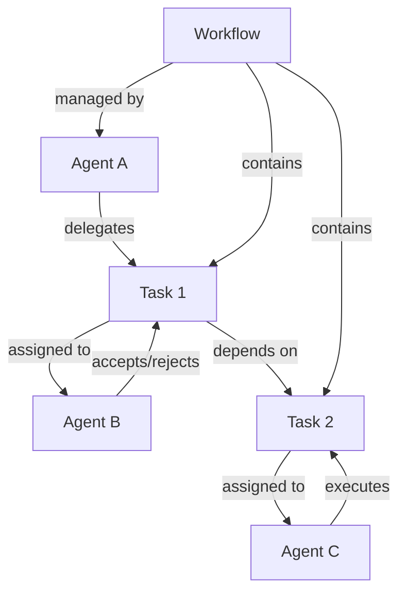
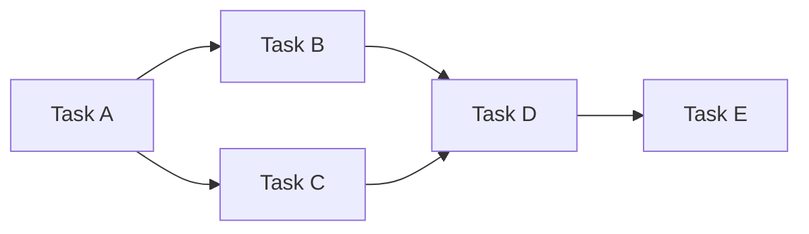

# Task Delegation and Workflow Coordination

This document provides comprehensive documentation for task delegation
mechanisms and workflow coordination patterns in the Agent Collaboration MCP
server, including dependency management and execution monitoring.

## Table of Contents

1. [Overview](#overview)
2. [Task Delegation](#task-delegation)
3. [Workflow Coordination](#workflow-coordination)
4. [Dependency Management](#dependency-management)
5. [Execution Monitoring](#execution-monitoring)
6. [API Reference](#api-reference)
7. [Examples](#examples)
8. [Best Practices](#best-practices)

## Overview

The task delegation and workflow coordination system enables agents to
collaborate effectively by distributing work, managing dependencies, and
coordinating complex multi-agent workflows. The system uses the knowledge graph
to track tasks, workflows, and their relationships.

### Core Concepts

- **Task Delegation**: Assigning tasks from one agent to another
- **Workflow**: A coordinated sequence of tasks involving multiple agents
- **Task Entity**: Knowledge graph representation of a task with metadata
- **Workflow Entity**: Knowledge graph representation of a workflow with
  participants
- **Dependencies**: Relationships between tasks that define execution order
- **Execution Monitoring**: Tracking task and workflow progress

### System Architecture



## Task Delegation

### Delegation Process

Task delegation involves creating a task entity, assigning it to a target agent,
and managing the delegation lifecycle.

#### Task Data Structure

```typescript
interface Task {
  taskId: string; // Unique task identifier
  title: string; // Task title
  description: string; // Detailed task description
  delegatingAgent: string; // Agent that created the task
  assignedAgent?: string; // Agent assigned to execute
  status:
    | "pending"
    | "assigned"
    | "accepted"
    | "rejected"
    | "in_progress"
    | "completed"
    | "failed";
  priority: "low" | "medium" | "high" | "urgent";
  deadline?: string; // ISO timestamp
  dependencies: string[]; // Array of task IDs this task depends on
  metadata: {
    estimatedDuration?: number; // Minutes
    requiredCapabilities?: string[];
    resources?: string[];
    context?: Record<string, any>;
    [key: string]: any;
  };
  createdAt: string; // ISO timestamp
  updatedAt: string; // ISO timestamp
}
```

#### Delegation Lifecycle

1. **Task Creation**: Delegating agent creates task with requirements
2. **Agent Assignment**: Task assigned to capable agent
3. **Acceptance/Rejection**: Assigned agent accepts or rejects task
4. **Execution**: Accepted task moves to in_progress status
5. **Completion**: Task marked as completed or failed
6. **Cleanup**: Task relationships updated

### MCP Tool: `delegate_task`

**Purpose**: Delegate a task to another agent

**Parameters**:

- `taskId` (string): Unique task identifier
- `title` (string): Task title
- `description` (string): Detailed task description
- `assignedAgent` (string): Target agent ID
- `priority` (string): Task priority level
- `deadline` (string, optional): Task deadline
- `dependencies` (array, optional): Dependent task IDs
- `metadata` (object, optional): Additional task metadata

**Example**:

```json
{
  "taskId": "task-001",
  "title": "Generate API Documentation",
  "description": "Create comprehensive API documentation for the user management service",
  "assignedAgent": "doc-agent-001",
  "priority": "high",
  "deadline": "2024-01-20T17:00:00Z",
  "dependencies": ["task-000"],
  "metadata": {
    "estimatedDuration": 120,
    "requiredCapabilities": ["documentation", "api-analysis"],
    "resources": ["api-spec.json", "code-repository"],
    "context": {
      "serviceVersion": "2.1.0",
      "format": "openapi"
    }
  }
}
```

**Response**:

```json
{
  "success": true,
  "taskId": "task-001",
  "status": "assigned",
  "assignedAgent": "doc-agent-001",
  "message": "Task delegated successfully"
}
```

### MCP Tool: `accept_delegation`

**Purpose**: Accept a delegated task

**Parameters**:

- `taskId` (string): Task identifier
- `agentId` (string): Accepting agent ID
- `estimatedCompletion` (string, optional): Estimated completion time
- `metadata` (object, optional): Acceptance metadata

**Example**:

```json
{
  "taskId": "task-001",
  "agentId": "doc-agent-001",
  "estimatedCompletion": "2024-01-20T16:00:00Z",
  "metadata": {
    "acceptedAt": "2024-01-15T10:30:00Z",
    "notes": "Will prioritize this task"
  }
}
```

**Response**:

```json
{
  "success": true,
  "taskId": "task-001",
  "status": "accepted",
  "estimatedCompletion": "2024-01-20T16:00:00Z"
}
```

### MCP Tool: `reject_delegation`

**Purpose**: Reject a delegated task

**Parameters**:

- `taskId` (string): Task identifier
- `agentId` (string): Rejecting agent ID
- `reason` (string): Rejection reason
- `metadata` (object, optional): Rejection metadata

**Example**:

```json
{
  "taskId": "task-001",
  "agentId": "doc-agent-001",
  "reason": "Insufficient capacity",
  "metadata": {
    "currentLoad": 5,
    "maxCapacity": 3,
    "suggestedAgent": "doc-agent-002"
  }
}
```

### MCP Tool: `get_agent_delegations`

**Purpose**: Get all delegations for a specific agent

**Parameters**:

- `agentId` (string): Agent identifier
- `status` (string, optional): Filter by status
- `includeCompleted` (boolean, optional): Include completed tasks

**Response**:

```json
{
  "delegations": [
    {
      "taskId": "task-001",
      "title": "Generate API Documentation",
      "status": "accepted",
      "priority": "high",
      "deadline": "2024-01-20T17:00:00Z",
      "delegatingAgent": "coordinator-001"
    }
  ],
  "count": 1
}
```

## Workflow Coordination

### Workflow Management

Workflows coordinate multiple tasks and agents to achieve complex objectives.

#### Workflow Data Structure

```typescript
interface Workflow {
  workflowId: string; // Unique workflow identifier
  name: string; // Workflow name
  description: string; // Workflow description
  coordinator: string; // Coordinating agent ID
  participants: string[]; // Participating agent IDs
  status:
    | "created"
    | "active"
    | "paused"
    | "completed"
    | "failed"
    | "cancelled";
  tasks: string[]; // Task IDs in this workflow
  dependencies: Record<string, string[]>; // Task dependency mapping
  metadata: {
    startTime?: string;
    endTime?: string;
    estimatedDuration?: number;
    priority?: string;
    context?: Record<string, any>;
    [key: string]: any;
  };
  createdAt: string;
  updatedAt: string;
}
```

### MCP Tool: `create_workflow`

**Purpose**: Create a new workflow

**Parameters**:

- `workflowId` (string): Unique workflow identifier
- `name` (string): Workflow name
- `description` (string): Workflow description
- `coordinator` (string): Coordinating agent ID
- `metadata` (object, optional): Workflow metadata

**Example**:

```json
{
  "workflowId": "workflow-001",
  "name": "Documentation Generation Pipeline",
  "description": "Complete pipeline for generating and publishing documentation",
  "coordinator": "coordinator-001",
  "metadata": {
    "priority": "high",
    "estimatedDuration": 480,
    "context": {
      "project": "api-service",
      "version": "2.1.0"
    }
  }
}
```

### MCP Tool: `create_collaborative_workflow`

**Purpose**: Create a workflow with multiple participants

**Parameters**:

- `workflowId` (string): Workflow identifier
- `name` (string): Workflow name
- `description` (string): Workflow description
- `coordinator` (string): Coordinating agent
- `participants` (array): Participating agent IDs
- `metadata` (object, optional): Workflow metadata

**Example**:

```json
{
  "workflowId": "collab-workflow-001",
  "name": "Multi-Agent Documentation Review",
  "description": "Collaborative workflow for documentation creation and review",
  "coordinator": "coordinator-001",
  "participants": ["doc-agent-001", "review-agent-001", "publish-agent-001"],
  "metadata": {
    "reviewCycles": 2,
    "approvalRequired": true
  }
}
```

### MCP Tool: `assign_task_to_agent`

**Purpose**: Assign a task to an agent within a workflow

**Parameters**:

- `taskId` (string): Task identifier
- `agentId` (string): Target agent ID
- `workflowId` (string, optional): Associated workflow
- `metadata` (object, optional): Assignment metadata

### MCP Tool: `get_agent_tasks`

**Purpose**: Get all tasks assigned to an agent

**Parameters**:

- `agentId` (string): Agent identifier
- `workflowId` (string, optional): Filter by workflow
- `status` (string, optional): Filter by status

**Response**:

```json
{
  "tasks": [
    {
      "taskId": "task-001",
      "title": "Generate API Documentation",
      "status": "in_progress",
      "workflowId": "workflow-001",
      "priority": "high",
      "deadline": "2024-01-20T17:00:00Z"
    }
  ],
  "count": 1
}
```

### Workflow Participation

#### MCP Tool: `join_workflow`

**Purpose**: Add an agent to a workflow

**Parameters**:

- `workflowId` (string): Workflow identifier
- `agentId` (string): Agent to add
- `role` (string, optional): Agent role in workflow
- `metadata` (object, optional): Participation metadata

#### MCP Tool: `leave_workflow`

**Purpose**: Remove an agent from a workflow

**Parameters**:

- `workflowId` (string): Workflow identifier
- `agentId` (string): Agent to remove
- `reason` (string, optional): Reason for leaving

#### MCP Tool: `update_workflow_status`

**Purpose**: Update workflow status

**Parameters**:

- `workflowId` (string): Workflow identifier
- `status` (string): New status
- `metadata` (object, optional): Status metadata

#### MCP Tool: `get_workflow_participants`

**Purpose**: Get all participants in a workflow

**Parameters**:

- `workflowId` (string): Workflow identifier

#### MCP Tool: `get_agent_workflows`

**Purpose**: Get all workflows an agent participates in

**Parameters**:

- `agentId` (string): Agent identifier
- `status` (string, optional): Filter by workflow status

## Dependency Management

### Dependency Types

1. **Sequential Dependencies**: Task B cannot start until Task A completes
2. **Parallel Dependencies**: Tasks can run simultaneously
3. **Conditional Dependencies**: Task execution depends on conditions
4. **Resource Dependencies**: Tasks share limited resources

### Dependency Resolution



### Dependency Management Example

```javascript
// Define task dependencies
const taskDependencies = {
  "task-001": [], // No dependencies
  "task-002": ["task-001"], // Depends on task-001
  "task-003": ["task-001"], // Depends on task-001
  "task-004": ["task-002", "task-003"], // Depends on both task-002 and task-003
  "task-005": ["task-004"] // Depends on task-004
};

// Check if task can be executed
function canExecuteTask(taskId, completedTasks) {
  const dependencies = taskDependencies[taskId] || [];
  return dependencies.every((depId) => completedTasks.includes(depId));
}

// Get next executable tasks
function getExecutableTasks(allTasks, completedTasks, inProgressTasks) {
  return allTasks.filter(
    (taskId) =>
      !completedTasks.includes(taskId) &&
      !inProgressTasks.includes(taskId) &&
      canExecuteTask(taskId, completedTasks)
  );
}
```

## Execution Monitoring

### Monitoring Components

1. **Task Status Tracking**: Monitor individual task progress
2. **Workflow Progress**: Track overall workflow completion
3. **Agent Performance**: Monitor agent efficiency and load
4. **Dependency Resolution**: Track dependency satisfaction
5. **Error Detection**: Identify and handle failures

### Monitoring Metrics

```typescript
interface MonitoringMetrics {
  taskMetrics: {
    total: number;
    pending: number;
    inProgress: number;
    completed: number;
    failed: number;
    averageCompletionTime: number;
  };
  workflowMetrics: {
    active: number;
    completed: number;
    failed: number;
    averageDuration: number;
  };
  agentMetrics: {
    [agentId: string]: {
      tasksAssigned: number;
      tasksCompleted: number;
      averageTaskTime: number;
      currentLoad: number;
    };
  };
}
```

### Real-time Monitoring Example

```javascript
class WorkflowMonitor {
  constructor() {
    this.metrics = {
      taskMetrics: {
        total: 0,
        pending: 0,
        inProgress: 0,
        completed: 0,
        failed: 0,
        averageCompletionTime: 0
      },
      workflowMetrics: {
        active: 0,
        completed: 0,
        failed: 0,
        averageDuration: 0
      },
      agentMetrics: {}
    };
  }

  async updateTaskStatus(taskId, newStatus, agentId) {
    // Update task status
    await callTool("update_task_status", {
      taskId,
      status: newStatus,
      updatedBy: agentId,
      timestamp: new Date().toISOString()
    });

    // Update metrics
    this.updateMetrics(taskId, newStatus, agentId);

    // Check workflow completion
    const workflow = await this.getTaskWorkflow(taskId);
    if (workflow) {
      await this.checkWorkflowCompletion(workflow.workflowId);
    }
  }

  async checkWorkflowCompletion(workflowId) {
    const workflow = await callTool("get_workflow_info", { workflowId });
    const tasks = await callTool("get_workflow_tasks", { workflowId });

    const allCompleted = tasks.every(
      (task) => task.status === "completed" || task.status === "failed"
    );

    if (allCompleted) {
      const hasFailures = tasks.some((task) => task.status === "failed");
      const newStatus = hasFailures ? "failed" : "completed";

      await callTool("update_workflow_status", {
        workflowId,
        status: newStatus,
        completedAt: new Date().toISOString()
      });
    }
  }

  generateReport() {
    return {
      timestamp: new Date().toISOString(),
      metrics: this.metrics,
      recommendations: this.generateRecommendations()
    };
  }

  generateRecommendations() {
    const recommendations = [];

    // Check for overloaded agents
    Object.entries(this.metrics.agentMetrics).forEach(([agentId, metrics]) => {
      if (metrics.currentLoad > 5) {
        recommendations.push({
          type: "agent_overload",
          agentId,
          message: `Agent ${agentId} is overloaded with ${metrics.currentLoad} tasks`
        });
      }
    });

    // Check for long-running tasks
    if (this.metrics.taskMetrics.averageCompletionTime > 240) {
      recommendations.push({
        type: "performance",
        message:
          "Average task completion time is high, consider task optimization"
      });
    }

    return recommendations;
  }
}
```

## API Reference

### Task Delegation Tools

| Tool                    | Purpose                | Parameters                                                                            | Response                   |
| ----------------------- | ---------------------- | ------------------------------------------------------------------------------------- | -------------------------- |
| `delegate_task`         | Create and assign task | taskId, title, description, assignedAgent, priority, deadline, dependencies, metadata | Task creation confirmation |
| `accept_delegation`     | Accept assigned task   | taskId, agentId, estimatedCompletion, metadata                                        | Acceptance confirmation    |
| `reject_delegation`     | Reject assigned task   | taskId, agentId, reason, metadata                                                     | Rejection confirmation     |
| `get_agent_delegations` | Get agent's tasks      | agentId, status, includeCompleted                                                     | Array of delegated tasks   |

### Workflow Coordination Tools

| Tool                            | Purpose                     | Parameters                                                         | Response                            |
| ------------------------------- | --------------------------- | ------------------------------------------------------------------ | ----------------------------------- |
| `create_workflow`               | Create new workflow         | workflowId, name, description, coordinator, metadata               | Workflow creation confirmation      |
| `create_collaborative_workflow` | Create multi-agent workflow | workflowId, name, description, coordinator, participants, metadata | Collaborative workflow confirmation |
| `assign_task_to_agent`          | Assign task in workflow     | taskId, agentId, workflowId, metadata                              | Assignment confirmation             |
| `get_agent_tasks`               | Get agent's tasks           | agentId, workflowId, status                                        | Array of assigned tasks             |
| `join_workflow`                 | Add agent to workflow       | workflowId, agentId, role, metadata                                | Join confirmation                   |
| `leave_workflow`                | Remove agent from workflow  | workflowId, agentId, reason                                        | Leave confirmation                  |
| `update_workflow_status`        | Update workflow status      | workflowId, status, metadata                                       | Status update confirmation          |
| `get_workflow_participants`     | Get workflow participants   | workflowId                                                         | Array of participating agents       |
| `get_agent_workflows`           | Get agent's workflows       | agentId, status                                                    | Array of workflows                  |

## Examples

### Complete Task Delegation Flow

```javascript
// 1. Create and delegate a documentation task
const delegationResult = await callTool("delegate_task", {
  taskId: "doc-task-001",
  title: "Create User Guide",
  description: "Create comprehensive user guide for the new API features",
  assignedAgent: "doc-agent-001",
  priority: "high",
  deadline: "2024-01-25T17:00:00Z",
  metadata: {
    estimatedDuration: 180,
    requiredCapabilities: ["documentation", "technical-writing"],
    resources: ["api-spec", "feature-list"],
    context: {
      targetAudience: "developers",
      format: "markdown"
    }
  }
});

console.log("Task delegated:", delegationResult);

// 2. Agent accepts the task
const acceptanceResult = await callTool("accept_delegation", {
  taskId: "doc-task-001",
  agentId: "doc-agent-001",
  estimatedCompletion: "2024-01-25T15:00:00Z",
  metadata: {
    notes: "Will start immediately after current task completion"
  }
});

console.log("Task accepted:", acceptanceResult);

// 3. Monitor task progress
const agentTasks = await callTool("get_agent_tasks", {
  agentId: "doc-agent-001",
  status: "accepted"
});

console.log("Agent tasks:", agentTasks);
```

### Multi-Agent Workflow Example

```javascript
// 1. Create collaborative workflow
const workflowResult = await callTool("create_collaborative_workflow", {
  workflowId: "doc-pipeline-001",
  name: "Documentation Pipeline",
  description: "End-to-end documentation creation and publishing pipeline",
  coordinator: "coordinator-001",
  participants: ["doc-agent-001", "review-agent-001", "publish-agent-001"],
  metadata: {
    priority: "high",
    estimatedDuration: 600,
    reviewRequired: true
  }
});

// 2. Create dependent tasks
const tasks = [
  {
    taskId: "doc-create-001",
    title: "Create Documentation",
    assignedAgent: "doc-agent-001",
    dependencies: []
  },
  {
    taskId: "doc-review-001",
    title: "Review Documentation",
    assignedAgent: "review-agent-001",
    dependencies: ["doc-create-001"]
  },
  {
    taskId: "doc-publish-001",
    title: "Publish Documentation",
    assignedAgent: "publish-agent-001",
    dependencies: ["doc-review-001"]
  }
];

// 3. Delegate tasks with dependencies
for (const task of tasks) {
  await callTool("delegate_task", {
    ...task,
    description: `${task.title} as part of documentation pipeline`,
    priority: "high",
    metadata: {
      workflowId: "doc-pipeline-001",
      dependencies: task.dependencies
    }
  });
}

// 4. Monitor workflow progress
const workflowParticipants = await callTool("get_workflow_participants", {
  workflowId: "doc-pipeline-001"
});

console.log("Workflow participants:", workflowParticipants);
```

### Dependency Management Example

```javascript
class DependencyManager {
  constructor() {
    this.taskGraph = new Map();
    this.completedTasks = new Set();
  }

  addTask(taskId, dependencies = []) {
    this.taskGraph.set(taskId, {
      dependencies,
      dependents: []
    });

    // Update dependents
    dependencies.forEach((depId) => {
      if (this.taskGraph.has(depId)) {
        this.taskGraph.get(depId).dependents.push(taskId);
      }
    });
  }

  canExecute(taskId) {
    const task = this.taskGraph.get(taskId);
    if (!task) return false;

    return task.dependencies.every((depId) => this.completedTasks.has(depId));
  }

  markCompleted(taskId) {
    this.completedTasks.add(taskId);

    // Check if any dependent tasks can now be executed
    const task = this.taskGraph.get(taskId);
    if (task) {
      return task.dependents.filter((depId) => this.canExecute(depId));
    }
    return [];
  }

  getExecutableTasks() {
    return Array.from(this.taskGraph.keys()).filter(
      (taskId) => !this.completedTasks.has(taskId) && this.canExecute(taskId)
    );
  }
}

// Usage example
const depManager = new DependencyManager();

// Add tasks with dependencies
depManager.addTask("task-1", []);
depManager.addTask("task-2", ["task-1"]);
depManager.addTask("task-3", ["task-1"]);
depManager.addTask("task-4", ["task-2", "task-3"]);

// Get initially executable tasks
console.log("Executable tasks:", depManager.getExecutableTasks()); // ['task-1']

// Mark task-1 as completed
const newlyExecutable = depManager.markCompleted("task-1");
console.log("Newly executable:", newlyExecutable); // ['task-2', 'task-3']
```

## Best Practices

### Task Delegation Best Practices

1. **Clear Task Definition**: Provide detailed descriptions and success criteria
2. **Appropriate Agent Selection**: Match tasks to agent capabilities
3. **Realistic Deadlines**: Set achievable deadlines with buffer time
4. **Dependency Management**: Clearly define task dependencies
5. **Resource Allocation**: Ensure required resources are available
6. **Progress Tracking**: Monitor task progress regularly
7. **Error Handling**: Implement robust error handling and recovery

### Workflow Coordination Best Practices

1. **Workflow Design**: Design workflows with clear objectives and milestones
2. **Participant Selection**: Choose appropriate agents for workflow roles
3. **Communication**: Establish clear communication channels
4. **Monitoring**: Implement comprehensive monitoring and alerting
5. **Flexibility**: Design workflows to handle changes and failures
6. **Documentation**: Document workflow processes and procedures
7. **Testing**: Test workflows before production deployment

### Dependency Management Best Practices

1. **Minimal Dependencies**: Keep dependencies to a minimum
2. **Clear Relationships**: Define clear dependency relationships
3. **Cycle Detection**: Implement cycle detection to prevent deadlocks
4. **Parallel Execution**: Maximize parallel task execution
5. **Conditional Logic**: Use conditional dependencies when appropriate
6. **Resource Constraints**: Consider resource constraints in dependencies
7. **Recovery Strategies**: Implement strategies for dependency failures

### Execution Monitoring Best Practices

1. **Real-time Monitoring**: Implement real-time progress tracking
2. **Alerting**: Set up alerts for critical issues and delays
3. **Metrics Collection**: Collect comprehensive performance metrics
4. **Dashboard Creation**: Create monitoring dashboards for visibility
5. **Automated Recovery**: Implement automated recovery mechanisms
6. **Performance Analysis**: Regularly analyze performance data
7. **Continuous Improvement**: Use monitoring data to improve processes

### Performance Optimization

1. **Load Balancing**: Distribute tasks evenly across agents
2. **Caching**: Cache frequently accessed data and results
3. **Batch Processing**: Process multiple tasks in batches when possible
4. **Resource Pooling**: Pool shared resources for efficiency
5. **Asynchronous Processing**: Use asynchronous processing for non-blocking
   operations
6. **Optimization Algorithms**: Use algorithms to optimize task scheduling
7. **Scalability Planning**: Plan for system scalability and growth

### Security Considerations

1. **Access Control**: Implement proper access control for task delegation
2. **Authentication**: Verify agent identity for all operations
3. **Authorization**: Ensure agents have permission for assigned tasks
4. **Data Protection**: Protect sensitive task and workflow data
5. **Audit Logging**: Log all delegation and workflow operations
6. **Secure Communication**: Use secure channels for agent communication
7. **Input Validation**: Validate all input parameters and data
